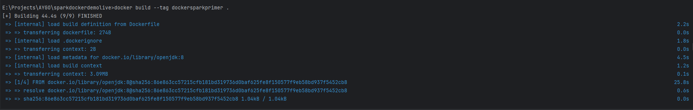

## TALLER DE INTRODUCCIÓN A VIRTUALIZACIÓN Y PROG. DISTRIBUIDA

## Resumen
Este repositorio contiene el resultado de la aplicación de técnicas de contenerización con Docker, aplicado sobre una solución de servidor web ligera cómo resultado del desarrollo del primer taller sobre virtualización y programación distribuida de la asignatura AYGO (Arquitectura y gobernabilidad). 

## Detalles técnicos del proyecto
- [Java 8](https://www.oracle.com/co/java/technologies/javase/javase8-archive-downloads.html)
- [Spark Java 2.9.2](https://mvnrepository.com/artifact/com.sparkjava/spark-core/2.9.2)
- [Maven](https://maven.apache.org/) 
- [Docker](https://www.docker.com/)

## Features 
- Servidor web simple que expone contenido en un puerto especificado. 

## Documentación de la solución

### Vista de Arquitectura


En esta vista se exponen los componentes principales de la solución. 
- Browser : Navegador genérico que realiza peticiones al servidor Web
- AWS Firewall: Corta fuegos de AWS en donde se definen las solicitudes y reglas a nivel de puertos/red de entrada/salida (Inbouind/outboud)
- EC2 Server: Maquina virtual de EC2 con una ip-pública asignada, el servidor EC2 mantendrá un micro-contenedor de Docker, vinculado a un puerto local en servicio
- Docker Container : Contenedor de docker que expone el servicio web por medio de un puerto definido por configuración. 
- JVM: Maquina virtual de Java (Entorno de ejecución del servidor web)
- SparkWebServer: Solución en Java que expone un mensaje "Hello Docker" cuando le es solicitado el contenido por el puerto especificado. 

### Componentes relevantes

### *SparkWebServer*
Clase encargada de crear el entorno de servidor web, definir el puerto de exposición y exponer el contenido. 
<details><summary>Desplegar Código fuente</summary>
<p>

#### Encontrado en main/java/SparkWebServer.java

```java

import static spark.Spark.*;

public class SparkWebServer {

    public static void main(String... args){
        port(getPort());
        get("hello", (req,res) -> "Hello Docker!");
    }

    private static int getPort() {
        if (System.getenv("PORT") != null) {
            return Integer.parseInt(System.getenv("PORT"));
        }
        return 4567;
    }

}
```
</details></p>


### *DockerFile*
Documento que especifica las dependencias para el micro-contenedor docker. En este caso la solución define un entorno de ejecución en una imagen estable de OpenJDK 8 con un puerto de exposición definido por configuración (6000 en este caso).  
<details><summary>Desplegar Código fuente</summary>
<p>

#### Encontrado en DockerFile

```

FROM openjdk:8
LABEL authors="sebas"

WORKDIR /usrapp/bin

ENV PORT 6000

COPY /target/classes /usrapp/bin/classes
COPY /target/dependency /usrapp/bin/dependency

CMD ["java","-cp","./classes:./dependency/*","SparkWebServer"]
```
</details></p>

## Instalación 
- Hacer el build de la solución utilizando el siguiente comando. 
```bash 
mvn clean install
```

- Construir la imagen de la solución con el siguiente comando.
```bash 
docker build --tag dockersparkprimer .
```

Cómo resultado de este comando una nueva imagen reutilizable de docker ha sido creada con el tag definido en el comando.
Esta imagen contiene no sólo las dependencias de la solución, sino todos los ejecutables necesarios cómo un conjunto de procesos. 

- Para ejecutar una instancia de la imagen anterior y vincular un puerto local al puerto del contenedor, utilice el siguiente comando 
```bash 
docker -p <puerto local>:<puerto del contenedor> --name <nombre de la instancia> <nombre de la imagen>
```
En la imagen de referencia ud encontrará un ejemplo de creación para tres instancias del mismo contenedor cada una vinculada a un puerto local distinto.

#### Instancia #1 

#### Instancia #2

#### Instancia #3


- Tambien puede usar el método de composición definido en el documento docker-compose.yml que en esta oportunidad vinculará la imagen al puerto 8087 y automatizará la creación de una base de datos de MongoDB. 
```bash 
docker-compose up -d
```
<details><summary>Desplegar Código fuente</summary>
<p>

#### Encontrado en DockerFile

```

version: '2'

services:
  web:
    build:
      context: .
      dockerfile: Dockerfile
    container_name: web
    ports:
      - "8087:6000"
  db:
    image: mongo:3.6.1
    container_name: db
    volumes:
      - mongodb:/data/db
      - mongodb_config:/data/configdb
    ports:
      - 27017:27017
    command: mongod

volumes:
  mongodb:
  mongodb_config:
```
</details></p>


- Para desplegar esta imagen a un repositorio de DockerHub puede utilizar los siguientes comandos. 
```bash 
docker tag dockersparkprimer <nombre de repositorio remoto dockerHub>
docker push <nombre de repositorio remoto dockerHub>:<version de la imagen a desplegar>
```


### Resultados de despliegue en EC2

Maquina virtual creada con puertos abiertos.


Instalación de imagen desde dockerhub a instancia EC2


Pruebas en instancia desplegada


## TALLER DE INTRODUCCIÓN A VIRTUALIZACIÓN Y PROG. DISTRIBUIDA

## Resumen
Este repositorio contiene el resultado de la aplicación de técnicas de contenerización con Docker, aplicado sobre una solución de servidor web ligera cómo resultado del desarrollo del primer taller sobre virtualización y programación distribuida de la asignatura AYGO (Arquitectura y gobernabilidad). 

## Detalles técnicos del proyecto
- [Java 8](https://www.oracle.com/co/java/technologies/javase/javase8-archive-downloads.html)
- [Spark Java 2.9.2](https://mvnrepository.com/artifact/com.sparkjava/spark-core/2.9.2)
- [Maven](https://maven.apache.org/) 
- [Docker](https://www.docker.com/)

## Features 
- Servidor web simple que expone contenido en un puerto especificado. 

## Documentación de la solución

### Vista de Arquitectura


En esta vista se exponen los componentes principales de la solución. 
- Browser : Navegador genérico que realiza peticiones al servidor Web
- AWS Firewall: Corta fuegos de AWS en donde se definen las solicitudes y reglas a nivel de puertos/red de entrada/salida (Inbouind/outboud)
- EC2 Server: Maquina virtual de EC2 con una ip-pública asignada, el servidor EC2 mantendrá un micro-contenedor de Docker, vinculado a un puerto local en servicio
- Docker Container : Contenedor de docker que expone el servicio web por medio de un puerto definido por configuración. 
- JVM: Maquina virtual de Java (Entorno de ejecución del servidor web)
- SparkWebServer: Solución en Java que expone un mensaje "Hello Docker" cuando le es solicitado el contenido por el puerto especificado. 

### Componentes relevantes

### *SparkWebServer*
Clase encargada de crear el entorno de servidor web, definir el puerto de exposición y exponer el contenido. 
<details><summary>Desplegar Código fuente</summary>
<p>

#### Encontrado en main/java/SparkWebServer.java

```java

import static spark.Spark.*;

public class SparkWebServer {

    public static void main(String... args){
        port(getPort());
        get("hello", (req,res) -> "Hello Docker!");
    }

    private static int getPort() {
        if (System.getenv("PORT") != null) {
            return Integer.parseInt(System.getenv("PORT"));
        }
        return 4567;
    }

}
```
</details></p>


### *DockerFile*
Documento que especifica las dependencias para el micro-contenedor docker. En este caso la solución define un entorno de ejecución en una imagen estable de OpenJDK 8 con un puerto de exposición definido por configuración (6000 en este caso).  
<details><summary>Desplegar Código fuente</summary>
<p>

#### Encontrado en DockerFile

```

FROM openjdk:8
LABEL authors="sebas"

WORKDIR /usrapp/bin

ENV PORT 6000

COPY /target/classes /usrapp/bin/classes
COPY /target/dependency /usrapp/bin/dependency

CMD ["java","-cp","./classes:./dependency/*","SparkWebServer"]
```
</details></p>

## Instalación 
- Hacer el build de la solución utilizando el siguiente comando. 
```bash 
mvn clean install
```

- Construir la imagen de la solución con el siguiente comando.
```bash 
docker build --tag dockersparkprimer .
```

Cómo resultado de este comando una nueva imagen reutilizable de docker ha sido creada con el tag definido en el comando.
Esta imagen contiene no sólo las dependencias de la solución, sino todos los ejecutables necesarios cómo un conjunto de procesos. 

- Para ejecutar una instancia de la imagen anterior y vincular un puerto local al puerto del contenedor, utilice el siguiente comando 
```bash 
docker -p <puerto local>:<puerto del contenedor> --name <nombre de la instancia> <nombre de la imagen>
```
En la imagen de referencia ud encontrará un ejemplo de creación para tres instancias del mismo contenedor cada una vinculada a un puerto local distinto.

#### Instancia #1 

#### Instancia #2

#### Instancia #3


- Tambien puede usar el método de composición definido en el documento docker-compose.yml que en esta oportunidad vinculará la imagen al puerto 8087 y automatizará la creación de una base de datos de MongoDB. 
```bash 
docker-compose up -d
```
<details><summary>Desplegar Código fuente</summary>
<p>

#### Encontrado en DockerFile

```

version: '2'

services:
  web:
    build:
      context: .
      dockerfile: Dockerfile
    container_name: web
    ports:
      - "8087:6000"
  db:
    image: mongo:3.6.1
    container_name: db
    volumes:
      - mongodb:/data/db
      - mongodb_config:/data/configdb
    ports:
      - 27017:27017
    command: mongod

volumes:
  mongodb:
  mongodb_config:
```
</details></p>


- Para desplegar esta imagen a un repositorio de DockerHub puede utilizar los siguientes comandos. 
```bash 
docker tag dockersparkprimer <nombre de repositorio remoto dockerHub>
docker push <nombre de repositorio remoto dockerHub>:<version de la imagen a desplegar>
```


### Resultados de despliegue en EC2

Maquina virtual creada con puertos abiertos.


Instalación de imagen desde dockerhub a instancia EC2


Pruebas en instancia desplegada


